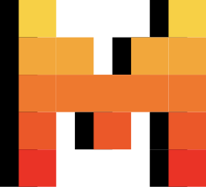

# API MODEL IA CHAT

Este proyecto es una api que permite interactuar con un servicio de chat basado en IA de manera gratis y sin necesidad de autenticación. Permite
crear un chat con modelos como *MINIO3*, *MINIO4*, *LLAMA*, *CLAUDE*, *MISTRAL*

> [!WARNING]  
> **Este proyecto se encuntra en desarrollo y depende de un servicio externo para funcionar.**

<div>



</div>

## Tabla de contenido

- [API MODEL IA CHAT](#api-model-ia-chat)
  - [Tabla de contenido](#tabla-de-contenido)
  - [Requisitos](#requisitos)
  - [Instalación](#instalación)
    - [Clona el repositorio](#clona-el-repositorio)
    - [Instala las dependencias](#instala-las-dependencias)
  - [Configura las variables de entorno](#configura-las-variables-de-entorno)
  - [Ejecuta el servidor](#ejecuta-el-servidor)
  - [Instalación con Docker](#instalación-con-docker)
  - [Uso](#uso)
    - [MINIO3](#minio3)
    - [MINIO4](#minio4)
    - [LLAMA](#llama)
    - [CLAUDE](#claude)
    - [MISTRAL](#mistral)
    - [About Me](#about-me)

## Requisitos

- Node.js 18 o superior
- NPM 9 o superior

## Instalación

### Clona el repositorio

```bash
git clone https://github.com/epmyas2022/api-chat-ia-model.git
cd api-model-ia-chat
```

### Instala las dependencias

```bash
npm install
```

Instalar navegadores de playwright

```bash
npx playwright install
```

## Configura las variables de entorno

Crea un archivo `.env` en la raíz del proyecto y añade las siguientes variables:

```env
EXTERNAL_CHAT_IA_URL=<url (ej: https://duckduckgo.com/duckchat/)>
EXTERNAL_API_KEY=<string | url> (ej: https://duckduckgo.com/?q=DuckDuckGo+AI+Chat&ia=chat&duckai=1)>
SECRET_KEY=<string hex 64 chars>
HOST=<string optional> (ej: 127.0.0.1)
PORT=<number optional> (ej: 3000)
````

## Ejecuta el servidor

```bash
npm start
```

si estas en desarrollo puedes usar el siguiente comando para que se reinicie automaticamente al hacer cambios

```bash
npm run start:dev
```

## Instalación con Docker

Para levantar un servicio de desarrollo puedes usar el siguiente comando:

```bash
docker-compose up -d api-development
```

Puedes consultar el servicio en la siguiente url:

```bash
http://localhost:9000
```

Para levantar un servicio de producción puedes usar el siguiente comando:

```bash
docker-compose up -d api-production
```

Puedes consultar el servicio en la siguiente url:

```bash
http://localhost:8080
```

## Uso

Para todos lo modelos la estructura de la peticion es la siguiente:

```json
{
 
    "message": "Hola, ¿cómo estás?",
    "cursor": null
}   
```

Tambien se puede hacer uso del `contextApi` esto nos permitira dar un contexto al modelo, para definir comportamientos o respuestas especificas.

Ejemplo usando el driver `standard`:

```json
{
  "message": "Hola",
  "contextApi": {
    "driver": "standard",
    "context": {
      "message": "Quiero que actues como un pirata y respondas como tal"
    }
  }
}
```

Ejemplo usando el driver `external`:

```json
{
 "message": "Hola",
 "contextApi": {
  "driver": "external",
  "external": {
   "endpoint": "https://dummyjson.com/c/b11c-f9b8-4e26-ac55",
   "jsonPath": "$.model.prompt",
   "query": {},
   "headers": {}
  }
 }
}
```

Para mantener la conversacion puedes usar el cursor que se devuelve en la respuesta anterior.

### MINIO3

```bash
curl -X POST http://localhost:3000/chat/v1/mini03 \
-H "Content-Type: application/json" \
-d '{ 
    "message": "Hola, ¿cómo estás?",
    }
```

### MINIO4

```bash
curl -X POST http://localhost:3000/chat/v1/mini04 \
-H "Content-Type: application/json" \
-d '{
   "message": "Hola, ¿cómo estás?",
}'
```

### LLAMA

```bash
curl -X POST http://localhost:3000/chat/v1/llama-turbo \
-H "Content-Type: application/json" \
-d '{
     "message": "Hola, ¿cómo estás?",
}'
```

### CLAUDE

```bash
curl -X POST http://localhost:3000/chat/v1/claude \
-H "Content-Type: application/json" \
-d '{
      "message": "Hola, ¿cómo estás?",
      "cursor": "9rsYHc2xXMCK7gF5HkEkFQ==#u7oUCWrDkimV4TKUaIJNsySQ2DPoe2JknqiJ36ccNPeDO/DomtEkHVOTB8mrpPo1huTa5vWGCbM"

}'
```

### MISTRAL

```bash
curl -X POST http://localhost:3000/chat/v1/mistral-small \
-H "Content-Type: application/json" \
-d '{
    "message": "Hola, ¿cómo estás?"
    "cursor": "9rsYHc2xXMCK7gF5HkEkFQ==#u7oUCWrDkimV4TKUaIJNsySQ2DPoe2JknqiJ36ccNPeDO/DomtEkHVOTB8mrpPo1huTa5vWGCbM"
}'
```

### About Me

```bash
curl -X POST http://localhost:3000/chat/about-me \
-H "Content-Type: application/json" \
-d '{
    "message": "Hola, ¿cómo estás?",
}'
```

Repuesta esperada:

```json

{
 "chat": {
  "id": "62c86d0a-d4a6-460f-bf23-e1a4129487d0",
  "model": "gpt-4o-mini",
  "message": "¡Hola! Soy Isaac Castillo, desarrollador de software con 2 años de experiencia en aplicaciones web y móviles. Actualmente trabajo en la Secretaría de Innovación de El Salvador. En mi tiempo libre disfruto jugar videojuegos, fútbol y pasar tiempo con mi gato Parches. Si tienes preguntas sobre mi trabajo o habilidades, estaré encantado de ayudarte. 😊",
  "created": "2025-05-10T19:20:07.943Z",
  "action": "chat"
 },
 "cursor": "9rsYHc2xXMCK7gF5HkEkFQ==#u7oUCWrDkimV4TKUaIJNsySQ2DPoe2JknqiJ36ccNPeDO/DomtEkHVOTB8mrpPo1huTa5vWGCbM"
}
```
